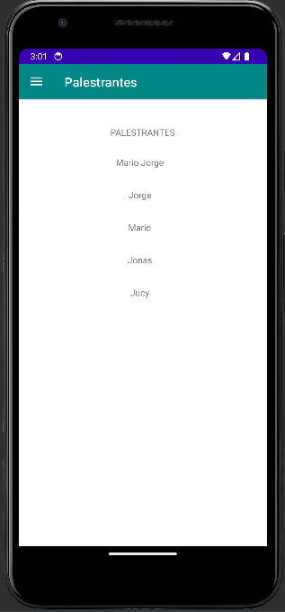

# SEMOC - Sistema para o evento 

O Semoc é um aplicativo Android que permite aos usuários visualizar informações sobre eventos e palestrantes da SEMOC. O aplicativo é composto por vários fragmentos e atividades que exibem essas informações de forma clara e interativa.

## Capturas de Tela

*Figura 1: Tela inicial exibindo eventos disponíveis*

*Figura 1.1: Tela  exibindo mais informações de um evento selecionado pelo usuário*

*Figura 2: Tela de palestrantes*

*Figura 2.1: Tela exibindo mais detalhes do palestrante selecionado*

*Figura 3: Mapa da Localização do Evento*

## Recursos Principais

- **Visualização de Eventos:** O fragmento "Home" exibe uma lista de eventos disponíveis, incluindo seus títulos e descrições. Os usuários podem tocar em um evento para obter mais detalhes.

- **Visualização de Palestrantes:** O fragmento "Palestrantes" exibe uma lista de palestrantes que participarão do evento. Os usuários podem tocar em um palestrante para visualizar informações detalhadas.

- **Mapa de Localização:** O fragmento "Mapa" exibe um mapa com a localização específica do evento.

## Tecnologias Usadas

- **Android:** O aplicativo é desenvolvido em Android e segue as melhores práticas de design de interface do usuário para dispositivos móveis.

- **Retrofit:** É usado para fazer chamadas de rede para buscar informações de eventos de uma fonte externa.

- **RecyclerView:** É utilizado para exibir listas de eventos e palestrantes de forma eficiente.

## API de Dados

O aplicativo consome uma API de dados para buscar informações sobre eventos. A interface `MyApiService` define os métodos de busca de dados, como a lista de eventos. Os dados são então exibidos nas atividades correspondentes.

## Contribuição

- Você é bem-vindo para contribuir para o projeto reportando problemas, enviando solicitações de pull ou melhorando a documentação.

## Autores

- [Lucas Araújo](https://github.com/Luckeditto) - Desenvolvedor
- [Bryan Hamilton](https://github.com/bhamilton0451) - Desenvolvedor
- [Eduardo Lopes](https://github.com/eduardolopesx02) - Desenvolvedor 

## Agradecimentos e Fontes

- Agradecemos a todos os colaboradores e à comunidade Android por tornar este projeto possível.
- Agradecimento especial ao professor Mario Jorge (https://cloud.google.com/apis?hl=pt-br) pelo direcionamento no trabalho, somos gratos.
- Foram utilizadas para pesquisa e elaboração do código várias fontes, das quais essas se destacam:
- https://square.github.io/retrofit/
- https://chat.openai.com/
- https://developer.android.com/docs?hl=pt-br
- https://cloud.google.com/apis?hl=pt-br
- StackOverflow
  

